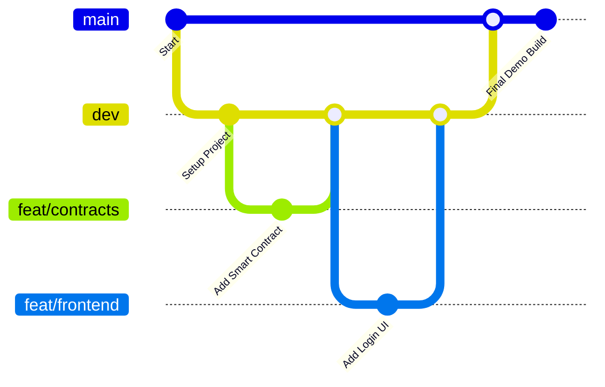

# Blockchain Voting with Zero Knowledge Proof

A blockchain-based voting system utilizing Zero Knowledge Proofs (ZKP) to ensure secure, transparent, and private voting. This repository contains the major project implementation, including smart contracts, frontend, backend, and documentation.

## 🔹 Branch Structure
- **main**: Stable, demo-ready code.  
- **dev**: Testing branch where all features are merged before main.  
- **feat/contracts**: Smart contract development (N + Amit).  
- **feat/frontend**: Next.js-based user interface (M).  
- **feat/backend**: Firebase backend integration (K).  
- **feat/docs**: Documentation and presentation slides (Amit + helpers).

## 🔹 Getting Started

### 1. Clone the Repository
Clone the project and navigate to the project directory:
```bash
git clone https://github.com/YOUR_USERNAME/blockchain-voting-zkp.git
cd blockchain-voting-zkp
```

### 2. Switch or Create a Branch
To work on an existing branch:
```bash
git checkout feat/contracts
```
To create a new branch for your work:
```bash
git checkout -b feat/your-feature
```

### 3. Pull Latest Changes
Always sync with the latest changes from the `dev` branch before starting work:
```bash
git pull origin dev
```

### 4. Make Your Changes
Edit code, documentation, or other files as needed. Stage and commit your changes:
```bash
git add .
git commit -m "feat: added castVote function"
```

### 5. Push to GitHub
Push your branch to the remote repository:
```bash
git push origin feat/your-feature
```

### 6. Open a Pull Request (PR)
1. Go to the repository on GitHub.
2. Navigate to **Pull Requests** > **New Pull Request**.
3. Select your branch (`feat/your-feature`) to merge into `dev`.
4. Add a clear description of your changes and testing details.
5. Assign a reviewer (e.g., Amit or N).

### 7. Final Merge
- The `dev` branch is merged into `main` by Amit only when stable.
- The `main` branch must always remain demo-ready.

## 🔹 Quick Commands Cheat Sheet
```bash
# Clone the project
git clone https://github.com/YOUR_USERNAME/blockchain-voting-zkp.git

# List all branches
git branch -a

# Create a new branch
git checkout -b feat/your-feature

# Switch to an existing branch
git checkout feat/your-feature

# Pull updates from dev
git pull origin dev

# Stage and commit changes
git add .
git commit -m "your message"

# Push branch to GitHub
git push origin feat/your-feature
```

## 🔹 Git Workflow Diagram


## 🔹 License
This project is licensed under the MIT License. See the [LICENSE](LICENSE) file for details.