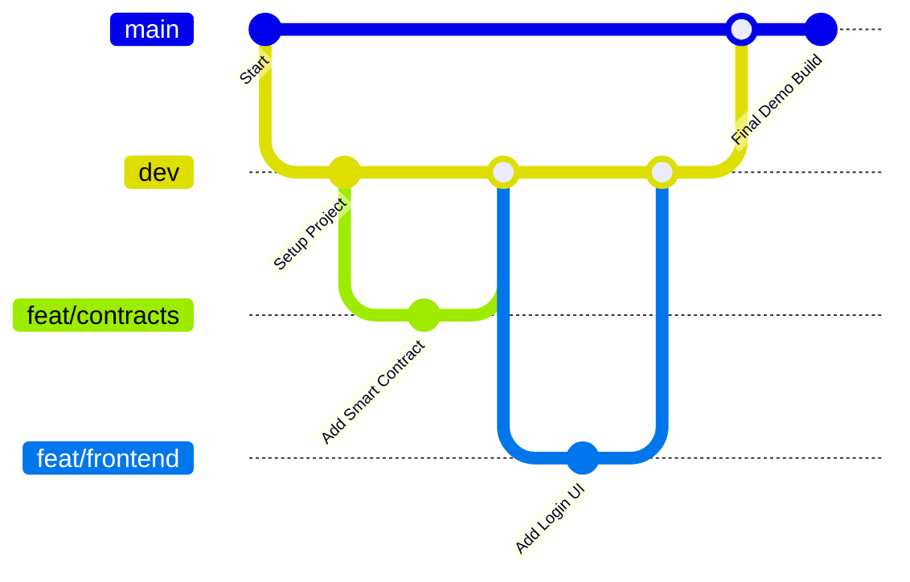

# 🗳️ Blockchain-Based Anonymous Voting System

[](https://soliditylang.org/)
[](https://getfoundry.sh/)
[](https://semaphore.pse.dev/)
[](https://opensource.org/licenses/MIT)

A privacy-preserving, gasless voting system built on Ethereum using **Zero-Knowledge Proofs**, **Semaphore Protocol**, and **Organizational Wallet Relayers**. This system enables anonymous voting without requiring users to manage crypto wallets or pay gas fees.

## 🏗️ System Architecture

```
┌─────────────────┐    ┌──────────────────┐    ┌─────────────────────┐
│   Voter (Web)   │───▶│  Backend + ZK    │───▶│  Blockchain Layer   │
│                 │    │                  │    │                     │
│ • Generate ZK   │    │ • Verify Proofs  │    │ • VotingSystem.sol  │
│ • Anonymous ID  │    │ • Select Relayer │    │ • Semaphore Verify  │
│ • No Wallet     │    │ • Submit Vote    │    │ • Nullifier Check   │
└─────────────────┘    └──────────────────┘    └─────────────────────┘
```

## Anonymous Voting Flow (Using Semaphore + Relayers)

```
                   +---------------------+
                   |  1. Admin (Owner)   |
                   +---------------------+
                            |
                            | initializeVoting(...)
                            V
+------------------+   Sets groupId, times, candidates
|  VotingSystem    |
|  Smart Contract  | <--------------------------------------+
+------------------+                                        |
         ^                                                  |
         |                                                  |
         |                     +-------------------------+  |
         |                     | 2. Semaphore Group Setup|  |
         |                     +-------------------------+  |
         |                     | Off-chain group manager |  |
         |                     | adds eligible voters    |  |
         |                     | (identity commitments)  |  |
         |                     +-------------------------+  |
         |                                                  |
         |                                                  |
         |                                                  |
         |                         Voter gets Semaphore ID  |
         |                    +--------------------------+  |
         |                    | 3. Voter (Anonymous)     |  |
         |                    +--------------------------+  |
         |                    | Has private identity     |  |
         |                    | Proves group membership  |  |
         |                    | Creates ZK proof locally |  |
         |                    +--------------------------+  |
         |                           |                         |
         |                           |                         |
         |                           V                         |
         |              ZK Proof + candidate ID + nullifier   |
         |                           |                         |
         |                           V                         |
         |                    +--------------------------+     |
         |                    | 4. Relayer (Trusted Org) |     |
         |                    +--------------------------+     |
         |                    | Verifies request         |     |
         |                    | Submits castVote() tx    |     |
         |                    +------------+-------------+     |
         |                                 |                   |
         |                                 V                   |
         |          +-------------------------------------+    |
         |          | 5. VotingSystem Smart Contract      |    |
         |          +-------------------------------------+    |
         |          | - Validates candidate ID            |    |
         |          | - Checks nullifier not used         |    |
         |          | - Verifies ZK proof via Semaphore   |    |
         |          | - Records vote                      |    |
         |          | - Emits VoteCast event              |    |
         |          +-------------------------------------+    |
         |                                                      |
         |<-----------------------------------------------------+
                           Event log (VoteCast)

```

## ✨ Key Features

- **🔐 Anonymous Voting** - Zero-Knowledge Proofs ensure voter privacy
- **💸 Gasless Experience** - Users don't need crypto wallets or ETH
- **🛡️ Double-Vote Prevention** - Nullifier-based anti-fraud system
- **⚡ Real-time Results** - Transparent vote counting on blockchain
- **🔒 Cryptographic Security** - Semaphore protocol for eligibility verification
- **🌐 Scalable Design** - Organizational wallet pool for high throughput

## 🛠️ Technology Stack

| Component | Technology | Purpose |
|-----------|------------|---------|
| **Smart Contracts** | Solidity + Foundry | On-chain vote storage & verification |
| **ZK Proofs** | Semaphore Protocol | Anonymous identity verification |
| **Wallet Management** | Ethers.js + Node.js | Organizational relayer system |
| **Cryptography** | Merkle Trees + Nullifiers | Eligibility & fraud prevention |
| **Blockchain** | Ethereum (Sepolia) | Immutable vote ledger |

---

## 📁 Project Structure

```
blockchain-voting-zk/
├── src/
│   ├── VotingSystem.sol              # Main voting contract
│   ├── SemaphoreVerifier.sol         # Semaphore Verifier contract
│   └── other semaphore related dep   # Helper libraries
├── scripts/
│   ├── deploy.js                     # Contract deployment 
│   ├── generate-wallets.js           # Organizational wallet creation 
│   └── manage-relayers.js            # Relayer management 
├── zk/
│   ├── create-identity.js            # Generate anonymous voter identities 
│   ├── setup-group.js                # Semaphore group creation 
│   ├── finalize-group.js             # Finalize voter group for voting 
│   ├── generate-proof.js             # ZK proof generation 
│   ├── verify-proof.js               # Proof verification utilities 
│   ├── download-circuits.js          # Download Semaphore circuits 
│   ├── zk_flow.md                    # ZK workflow documentation 
│   ├── group.json                    # Current voter group state 
│   ├── proof.json                    # Latest generated proof 
│   ├── group_snapshot_*.json         # Group state snapshots 
│   └── identity_*.json               # Generated voter identities 
├── wallets/
│   ├── organizational-wallets.encrypted.json  # Encrypted wallet keys 
│   ├── wallet-addresses.json         # Public wallet addresses 
│   ├── wallets-dev-only.json         # Unencrypted wallets (dev) 
│   ├── funding-history.json          # Wallet funding records 
│   └── relayer-transactions.json     # Contract authorization TXs 
├── deployments/
│   ├── sepolia.json                  # Sepolia deployment info 
│   └── sepolia-abi.json              # Contract ABI for integration 
├── test/
│   ├── VotingSystem.t.sol            # Contract tests 
│   └── integration/                  # E2E tests
└── out/                              # Foundry build artifacts 
```

---

## 🚀 Implementation Details

### 1. **Smart Contract System** 

#### **VotingSystem.sol** - Main Contract
```solidity
contract VotingSystem is Ownable, ReentrancyGuard, Pausable {
    // Core state variables
    uint256 public votingGroupId;           // Semaphore group ID
    mapping(uint256 => uint256) public voteCounts;     // Vote tallies
    mapping(uint256 => bool) public usedNullifiers;   // Double-vote prevention
    mapping(address => bool) public authorizedRelayers; // Gasless wallets
    
    // Main voting function
    function castVote(
        uint256 candidateId,
        uint256 nullifierHash,
        uint256[8] calldata proof
    ) external onlyAuthorizedRelayer;
}
```

**Key Functions:**
- ✅ `castVote()` - Anonymous vote submission with ZK proof
- ✅ `addRelayer()` - Authorize organizational wallets
- ✅ `initializeVoting()` - Set up election parameters
- ✅ `getResults()` - Real-time vote counting

#### **Security Features:**
- **Reentrancy Protection** - Prevents double-spending attacks
- **Pausable Mechanism** - Emergency stop functionality  
- **Access Control** - Owner-only administrative functions
- **Nullifier Tracking** - Prevents duplicate voting
- **ZK Proof Verification** - Semaphore protocol integration

### 2. **Organizational Wallet System**

#### **Gasless Transaction Architecture**
```javascript
// 10 Pre-funded wallets relay votes on behalf of users
const organizationalWallets = [
    { id: 1, address: "0x123...", privateKey: "encrypted" },
    { id: 2, address: "0x456...", privateKey: "encrypted" },
    // ... 8 more wallets
];

// Random selection for vote submission
function selectRandomRelayer(wallets) {
    const randomIndex = Math.floor(Math.random() * wallets.length);
    return wallets[randomIndex];
}
```

#### **Generated Wallet Files**
- 🔒 `organizational-wallets.encrypted.json` - AES-256 encrypted private keys
- 📋 `wallet-addresses.json` - Public addresses for frontend integration
- ⚠️ `wallets-dev-only.json` - Unencrypted keys (development only)
- 💰 `funding-history.json` - Complete funding transaction records
- 🔗 `relayer-transactions.json` - Contract authorization history

### 3. **Zero-Knowledge Proof System**

#### **Complete ZK Workflow Implementation**
```javascript
// 1. Identity Creation (create-identity.js)
const identity = new Identity();
const commitment = identity.commitment;

// 2. Group Setup (setup-group.js)
const group = new Group(groupId, treeDepth);
group.addMember(commitment);

// 3. Group Finalization (finalize-group.js)
const finalGroup = await finalizeGroup(groupSnapshot);

// 4. Proof Generation (generate-proof.js)
const proof = await generateProof(identity, group, candidateId, pollId);

// 5. Proof Verification (verify-proof.js)
const isValid = await verifyProof(proof, group.root, candidateId, pollId);
```

#### **ZK Implementation Files**
- 📝 `create-identity.js` - Anonymous voter identity generation
- 🌳 `setup-group.js` - Semaphore group creation with voter commitments
- ✅ `finalize-group.js` - Lock group for voting phase
- 🔐 `generate-proof.js` - ZK proof generation for votes
- ✓ `verify-proof.js` - Proof verification utilities
- ⬇️ `download-circuits.js` - Automated circuit file management
- 📋 `zk_flow.md` - Complete workflow documentation

#### **Generated ZK Assets**
- `group.json` - Current voter group state
- `proof.json` - Latest generated proof data
- `group_snapshot_*.json` - Timestamped group states
- `identity_*.json` - Generated voter identities for testing

#### **ZK Proof Components:**
- 🌳 **Merkle Tree** - Efficient voter eligibility verification
- 🔑 **Identity Commitment** - Anonymous voter fingerprint  
- 🚫 **Nullifier Hash** - Unique vote identifier (prevents double-voting)
- ✅ **Proof Verification** - On-chain and off-chain validation
- 🎯 **Signal** - The vote choice being cast

### 4. **Deployment & Network Configuration**

#### **Multi-Network Support**
```javascript
const NETWORKS = {
    sepolia: {
        name: 'Sepolia Testnet',
        rpcUrl: 'https://eth-sepolia.g.alchemy.com/v2/API_KEY',
        chainId: 11155111,
        explorerUrl: 'https://sepolia.etherscan.io'
    },
    // Additional networks...
};
```

#### **Deployment Process:**
1. **Contract Compilation** - `forge build`
2. **Semaphore Verifier** - Deploy or use existing
3. **VotingSystem Contract** - Deploy with verifier address
4. **Wallet Generation** - Create 10 organizational wallets
5. **Funding & Authorization** - Fund wallets, add as relayers
6. **Group Setup** - Initialize Semaphore voting group

---

## 🔧 Development Setup

### **Prerequisites**
- Node.js 18+
- Foundry toolkit
- Testnet ETH (Sepolia)
- Alchemy/Infura RPC endpoint

### **Installation**
```bash
# Clone repository
git clone <repository-url>
cd blockchain-voting-zk

# Install dependencies
npm install

# Install Foundry dependencies
forge install

# Set up environment
cp .env.example .env
# Edit .env with your configuration
```

### **Compilation & Testing**
```bash
# Compile contracts
forge build

# Run tests
forge test -vv

# Run with gas reporting
forge test --gas-report

# Test specific contract
forge test --match-contract VotingSystem
```

---

## 📡 Deployment Guide

### **1. Environment Setup**
```bash
# .env configuration
SEPOLIA_RPC_URL=https://eth-sepolia.g.alchemy.com/v2/YOUR_API_KEY
PRIVATE_KEY=your_deployer_private_key
ETHERSCAN_API_KEY=your_etherscan_api_key
```

### **2. Deploy Contracts**
```bash
# Deploy to Sepolia testnet
node scripts/deploy.js --network sepolia

# Or using npm scripts
npm run deploy -- --network sepolia
```

### **3. Set Up Organizational Wallets**
```bash
# Generate 10 wallets
npm run wallets:generate "secure-password"

# Fund wallets with testnet ETH  
npm run wallets:fund

# Add wallets as authorized relayers
npm run relayers:add $CONTRACT_ADDRESS $RPC_URL $OWNER_PRIVATE_KEY

# Verify setup
npm run relayers:verify $CONTRACT_ADDRESS $RPC_URL
```

### **4. Complete ZK Workflow**
```bash
# 1. Download required circuits
node zk/download-circuits.js

# 2. Create voter identities  
node zk/create-identity.js

# 3. Set up voting group
node zk/setup-group.js

# 4. Finalize group for voting
node zk/finalize-group.js

# 5. Generate vote proof
node zk/generate-proof.js

# 6. Verify proof locally
node zk/verify-proof.js
```

---

## 🧪 Testing & Verification

### **Smart Contract Tests**
```bash
# Run all tests
forge test

# Specific test categories
forge test --match-test testVoteCasting
forge test --match-test testDoubleVotePrevention  
forge test --match-test testRelayerAuthorization
```

### **Integration Testing**
```bash
# End-to-end voting flow
npm run test:integration

# ZK proof generation & verification
node zk/test-proof-flow.js

# Wallet system health check
npm run wallets:health
```

### **Gas Analysis**
```solidity
// Typical gas costs:
Contract Deployment: ~2,500,000 gas
Vote Casting: ~150,000 gas  
Relayer Addition: ~50,000 gas
Proof Verification: ~300,000 gas
```

---

## 📊 Deployment Status

### **✅ Live Sepolia Deployment**

| Component | Status | Network | Address |
|-----------|---------|---------|---------|
| **VotingSystem Contract** |  Deployed | Sepolia | `0x881f0f817B0bdE9F9495dDbDB4E6C06A9D9F5714` |
| **Semaphore Verifier** |  Deployed | Sepolia | `0xB325230f89473f3032575Fb22137Eb5F040D5ae9` |
| **Deployer Account** |  Active | Sepolia | `0x4e656dA2f7e75d0d0d847b3aAbAD93364F8Eb652` |
| **Organizational Wallets** |  Generated | - | 10 wallets created & funded |
| **Relayer Authorization** |  Complete | - | All wallets authorized |
| **Semaphore Groups** |  Created | - | Voter commitments added |
| **ZK Proof System** |  Working | - | Full proof generation/verification |

### **📈 Deployment Metrics**
- **Total Gas Used**: 1,903,089 gas
- **Deployment Cost**: ~0.004 ETH (Sepolia)
- **Block Confirmations**: 12 blocks
- **Contract Size**: Optimized for mainnet deployment

### **🔍 Verification Links**
- **VotingSystem Contract**: [0x881f0f817B0bdE9F9495dDbDB4E6C06A9D9F5714](https://sepolia.etherscan.io/address/0x881f0f817B0bdE9F9495dDbDB4E6C06A9D9F5714)
- **Semaphore Verifier**: [0xB325230f89473f3032575Fb22137Eb5F040D5ae9](https://sepolia.etherscan.io/address/0xB325230f89473f3032575Fb22137Eb5F040D5ae9)
- **Deployer Account**: [0x4e656dA2f7e75d0d0d847b3aAbAD93364F8Eb652](https://sepolia.etherscan.io/address/0x4e656dA2f7e75d0d0d847b3aAbAD93364F8Eb652)

---

## 🔐 Security Considerations

### **Implemented Security Measures**

1. **Smart Contract Security**
   - ✅ Reentrancy guards on state-changing functions
   - ✅ Access control for administrative functions
   - ✅ Pausable mechanism for emergency stops
   - ✅ Integer overflow protection (Solidity 0.8+)

2. **Cryptographic Security** 
   - ✅ Semaphore ZK-SNARK circuits for anonymous proofs
   - ✅ Poseidon hash function for efficiency
   - ✅ Merkle tree-based membership verification
   - ✅ Nullifier uniqueness enforcement

3. **Operational Security**
   - ✅ Encrypted private key storage (AES-256)
   - ✅ Secure RPC endpoints (HTTPS)
   - ✅ Environment variable isolation
   - ✅ Multi-wallet redundancy

### **Potential Considerations**
- **Coercion Resistance** - Users could be forced to vote specific way
- **Scalability** - ZK proof generation takes 10-30 seconds
- **Key Management** - Organizational wallet security is critical
- **Network Dependency** - Requires stable RPC connection

---

## 🚀 Performance Metrics

### **Throughput Analysis**
- **Votes per Second**: ~10-50 (limited by ZK proof generation)
- **Concurrent Users**: 1000+ (backend can handle multiple proof generations)
- **Relayer Pool**: 10 wallets can process votes in parallel
- **Transaction Confirmation**: 15-30 seconds (Sepolia block time)

### **Cost Analysis** (Sepolia Testnet)
```
Contract Deployment: 1,903,089 gas (~0.004 ETH)
  - Semaphore Verifier: ~1,200,000 gas
  - VotingSystem: ~703,089 gas
Organizational Wallet Funding: ~1.0 ETH (0.1 ETH × 10 wallets)  
Vote Transaction: ~150,000 gas (~0.0003 ETH per vote)
Daily Operations: ~0.1 ETH (assuming 1000 votes)
```

---

## 📚 Usage Examples

### **Backend Integration**
```javascript
import { getRandomRelayer, getRelayerWithPrivateKey } from './scripts/manage-relayers.js';
import { ethers } from 'ethers';

// Select random relayer for vote submission
const relayerAddress = await getRandomRelayer(contractAddress, rpcUrl);
const relayerWallet = getRelayerWithPrivateKey(relayerAddress, password);

// Create contract instance
const provider = new ethers.JsonRpcProvider(rpcUrl);
const signer = new ethers.Wallet(relayerWallet.privateKey, provider);
const contract = new ethers.Contract(contractAddress, abi, signer);

// Submit vote with ZK proof
const tx = await contract.castVote(candidateId, nullifierHash, proof);
await tx.wait();
```

### **ZK Proof Generation**
```javascript
import { Identity } from "@semaphore-protocol/identity";
import { generateProof } from "@semaphore-protocol/proof";

// Create anonymous voter identity
const identity = new Identity();

// Generate proof for vote
const proof = await generateProof(
    identity,
    group,
    candidateId,  // What we're voting for
    pollId,       // Which poll/election
    { zkeyFilePath: "./semaphore.zkey", wasmFilePath: "./semaphore.wasm" }
);
```

---

## 🤝 Team & Contributors

**Blockchain Developer**: Implementation of smart contracts, ZK integration, wallet management, and deployment infrastructure.

**Responsibilities Completed**:
- ✅ VotingSystem smart contract development
- ✅ Semaphore ZK proof integration  
- ✅ Organizational wallet system
- ✅ Deployment scripts and infrastructure
- ✅ Testing framework and security analysis
- ✅ Documentation and code organization

---

## 📄 License

This project is licensed under the MIT License - see the [LICENSE](LICENSE) file for details.

---

## 🔗 Additional Resources

- **Semaphore Documentation**: https://semaphore.pse.dev/
- **Foundry Book**: https://book.getfoundry.sh/
- **Ethereum Development**: https://ethereum.org/developers/
- **ZK-SNARK Explainer**: https://blog.ethereum.org/2016/12/05/zksnarks-in-a-nutshell
- **Solidity Documentation**: https://docs.soliditylang.org/

---

*Built with ❤️ for privacy-preserving digital democracy*
# Blockchain Voting with Zero Knowledge Proof

A blockchain-based voting system utilizing Zero Knowledge Proofs (ZKP) to ensure secure, transparent, and private voting. This repository contains the major project implementation, including smart contracts, frontend, backend, and documentation.

## 🔹 Branch Structure
- **main**: Stable, demo-ready code.  
- **dev**: Testing branch where all features are merged before main.  
- **feat/contracts**: Smart contract development (N + A).  
- **feat/frontend**: Next.js-based user interface (M).  
- **feat/backend**: Firebase backend integration (K).  
- **feat/docs**: Documentation and presentation slides (A + helpers).

## 🔹 Getting Started

### 1. Clone the Repository
Clone the project and navigate to the project directory:
```bash
git clone https://github.com/YOUR_USERNAME/blockchain-voting-zkp.git
cd blockchain-voting-zkp
```

### 2. Switch or Create a Branch
To work on an existing branch:
```bash
git checkout feat/contracts
```
To create a new branch for your work:
```bash
git checkout -b feat/your-feature
```

### 3. Pull Latest Changes
Always sync with the latest changes from the `dev` branch before starting work:
```bash
git pull origin dev
```

### 4. Make Your Changes
Edit code, documentation, or other files as needed. Stage and commit your changes:
```bash
git add .
git commit -m "feat: added castVote function"
```

### 5. Push to GitHub
Push your branch to the remote repository:
```bash
git push origin feat/your-feature
```

### 6. Open a Pull Request (PR)
1. Go to the repository on GitHub.
2. Navigate to **Pull Requests** > **New Pull Request**.
3. Select your branch (`feat/your-feature`) to merge into `dev`.
4. Add a clear description of your changes and testing details.
5. Assign a reviewer (e.g., Aor N).

### 7. Final Merge
- The `dev` branch is merged into `main` by A only when stable.
- The `main` branch must always remain demo-ready.

## 🔹 Quick Commands Cheat Sheet
```bash
# Clone the project
git clone https://github.com/YOUR_USERNAME/blockchain-voting-zkp.git

# List all branches
git branch -a

# Create a new branch
git checkout -b feat/your-feature

# Switch to an existing branch
git checkout feat/your-feature

# Pull updates from dev
git pull origin dev

# Stage and commit changes
git add .
git commit -m "your message"

# Push branch to GitHub
git push origin feat/your-feature
```

## 🔹 Git Workflow Diagram

```mermaid
gitGraph
   commit id: "Start"
   branch dev
   commit id: "Setup Project"
   branch feat/contracts
   commit id: "Add Smart Contract"
   checkout dev
   merge feat/contracts
   branch feat/frontend
   commit id: "Add Login UI"
   checkout dev
   merge feat/frontend
   checkout main
   merge dev
   commit id: "Final Demo Build"
```

## 🔹 License
This project is licensed under the MIT License. See the [LICENSE](LICENSE) file for details.
