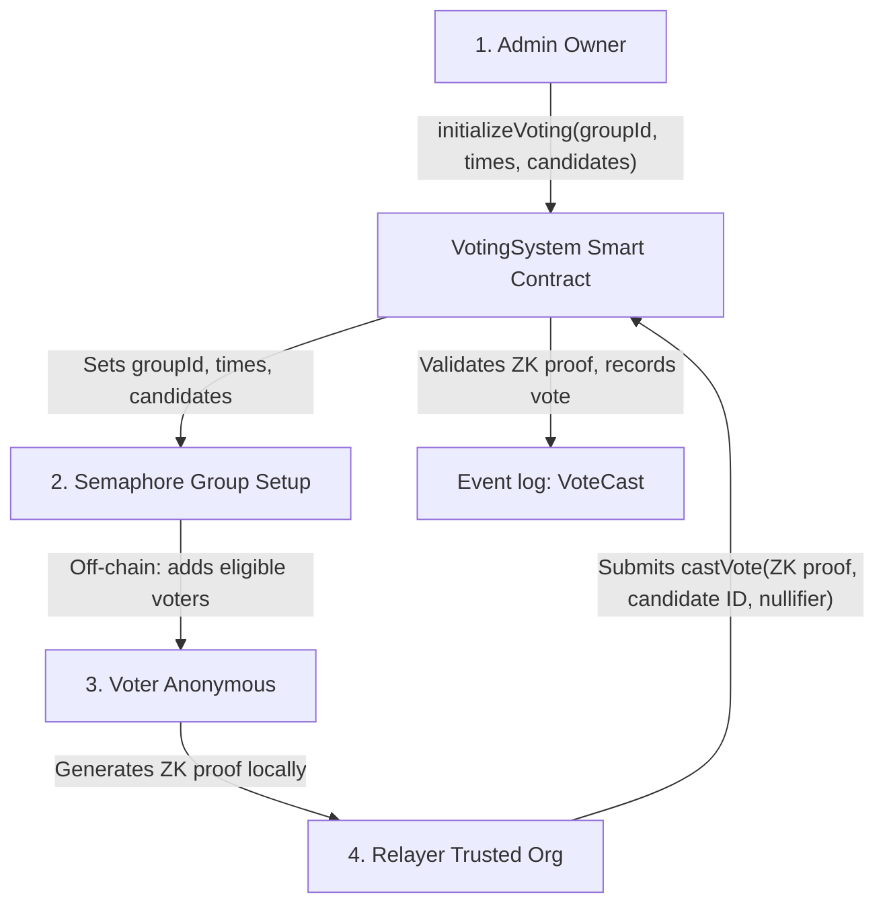

# VotingSystem Smart Contract Documentation

This smart contract, named **VotingSystem**, implements an anonymous, gasless voting mechanism using Semaphore zero-knowledge proofs (ZKPs) on the Ethereum blockchain (or compatible chains). Below is a detailed breakdown of its purpose, functionality, and workflow.

## 🔐 Purpose of the Contract

The **VotingSystem** contract enables anonymous, one-time voting with the following guarantees:

- **Voter Anonymity**: Ensures voter identities remain private.
- **Gasless Voting**: Votes are cast via organizational relayers, eliminating gas costs for voters.
- **Prevention of Double Voting**: Enforces one vote per voter.
- **Transparency**: Votes are publicly auditable on-chain.

This contract is ideal for organizations or DAOs seeking anonymous yet verifiable elections.

## ⚙️ Core Concepts and Components

### ✅ 1. Semaphore Integration

The contract uses the **Semaphore protocol** to enable zero-knowledge proofs (ZKPs), allowing voters to:

- Prove membership in a voter group (via `groupId`) without revealing their identity.
- Confirm they haven't voted before (via `nullifierHash`).
- Maintain anonymity by not linking votes to wallet addresses.

### ⚡ 2. Gasless Voting via Relayers

- Voters do not submit transactions directly.
- Authorized **relayers** (e.g., organizational wallets) submit votes on behalf of voters, covering gas costs.

### 🔒 3. One-Person-One-Vote

- Each vote includes a unique `nullifierHash` to prevent double voting.
- The `usedNullifiers` mapping tracks used nullifiers, ensuring each voter casts only one vote.

## 🧱 Main Functional Components

### 🏗️ Setup

- **initializeVoting(...)**: Configures a single voting session with:
  - Semaphore `groupId`
  - Start and end timestamps
  - Number of candidates
  - Can only be called once by the contract owner.

### 🧑‍⚖️ Admin Functions

- **addRelayer(...)** / **removeRelayer(...)**: Manages trusted relayers.
- **pauseVoting()** / **unpauseVoting()**: Emergency controls to pause or unpause voting.

### 🗳️ Voting

- **castVote(...)**:
  - Callable only by authorized relayers during the voting window.
  - Inputs:
    - Candidate ID
    - Semaphore ZK proof components
    - `publicSignals` (including candidate ID, `nullifierHash`, Merkle root, `groupId`, etc.)
    - Merkle tree depth
  - Validates:
    - Candidate exists
    - Voting is active
    - Nullifier hasn't been used
    - ZK proof is valid
  - Actions:
    - Increments vote count for the candidate
    - Marks the nullifier as used

### 🔍 View Functions

Provide transparency with the following functions:

- **getVoteCount(candidateId)**: Returns vote count for a specific candidate.
- **getAllVoteCounts()**: Returns vote counts for all candidates.
- **isVotingActive()**: Checks if voting is currently open.
- **getVotingInfo()**: Returns voting parameters and total votes.
- **getRelayers()**: Lists authorized relayers.
- **getResultPercentages()**: Returns vote share percentages (with 2 decimal places).

## 🧠 Summary

| **Feature**           | **Description**                                      |
|-----------------------|-----------------------------------------------------|
| **Anonymity**         | Achieved using Semaphore ZK proofs                  |
| **Gasless Voting**    | Votes submitted by authorized relayers              |
| **One Vote per Voter**| Enforced via `nullifierHash` and ZK proof           |
| **Trustless Tally**   | Votes publicly counted and auditable                |
| **Configurable**      | Admin sets group, time, and candidates              |
| **Emergency Controls**| Pause/unpause functionality for safety              |

## 🔍 Example Use Case

An organization conducting a board election:

1. Adds eligible voters to a Semaphore group (off-chain identity commitments).
2. Configures the contract with voting times and candidate list.
3. Distributes Semaphore identity commitments to voters off-chain.
4. Voters generate ZK proofs and submit them via a relayer (e.g., through a frontend).
5. Votes are cast anonymously and tallied on-chain.

## 🗳️ Anonymous Voting Flow (Using Semaphore + Relayers)

### 🔍 Explanation of Voting Flow

| **Step** | **Description**                                                                 |
|----------|--------------------------------------------------------------------------------|
| 1        | Admin initializes the voting session with configuration (group ID, times, candidates). |
| 2        | A Semaphore group is maintained off-chain with identity commitments of eligible voters. |
| 3        | Voters generate ZK proofs locally using their Semaphore identity (no wallet needed). |
| 4        | Proofs are submitted to the contract via authorized relayer wallets.             |
| 5        | The contract verifies the ZK proof, checks for double voting, and records the vote. |

### ✅ Key Features Captured in Diagram

- **Off-chain proof generation**: Ensures voter anonymity.
- **On-chain verification**: Validates eligibility and vote integrity.
- **Gasless UX**: Relayers handle transaction costs.
- **ZK integrity**: Nullifiers prevent double voting.
